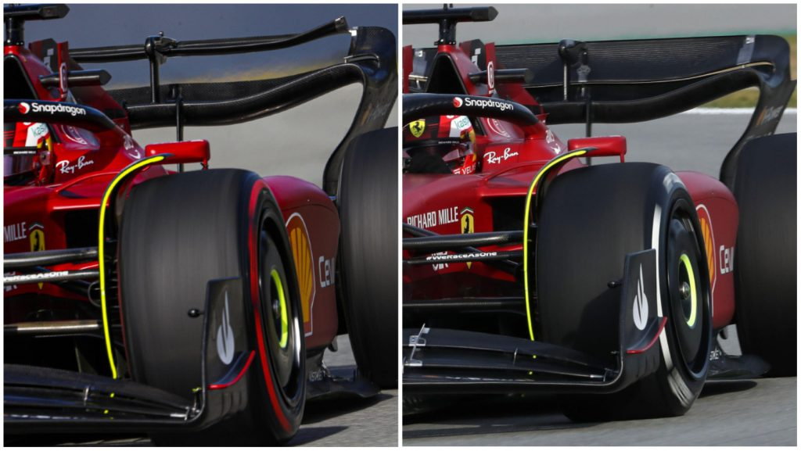

```{r setup, include=FALSE}

knitr::opts_chunk$set(echo = FALSE, message = FALSE, warning = FALSE)

library(dplyr)
library(stringr)
library(tidyverse)
library(ggplot2)
library(gridExtra)
library(ggthemes)
library(patchwork) 
library(grid)
library(ggrepel)
library(forcats)
library(RColorBrewer)
library(viridis)
library(kableExtra)

source("ProgettoDRS.R")

```

```{=html}
<style>
div.blue pre { background-color:#B6DBE8; }
div.blue pre.r { background-color:black; }
</style>
```
```{=html}
<style type="text/css">
body{
  font-family: Helvetica;
  font-size: 16pt;
}
h1{
  margin-top:0px;
  margin-bottom:0px;
  font-weight: bold;
  font-size: 35pt;
  line-height: 40px; 
  color: #2D4EBF;
  
}
h2{
  margin-top:0px;
  margin-bottom:0px;
  font-size: 30pt;
  line-height: 38px; 
  color:#424E76;
}
h3{
  margin:0px;
  font-size: 25pt;
}
h4,h5,h6{
  font-size: 15pt;
}
</style>
```
## Le domande che mi sono posto:

-   Il DRS è stato aggiunto in F1 nel 2011, ma la sua introduzione che cambiamenti ha portato?
-   Quali sono i circuiti e le stagioni con più sorpassi?
-   Nel 2022, rispetto al 2011, i sorpassi sono aumentati?
-   Qual'è il pilota che ha effettuato più sorpassi e quello che ne ha subiti di più?
-   Come mai nel 2022 in Ungheria ci sono stati così tanti sorpassi rispetto all'anno prima?


## Fonti

### Dataset: 

[Elenco dataset stagionali](https://www.reddit.com/r/formula1/comments/nf4jkq/f1_overtaking_database_19942020/)

<br>

### Check dati:

[Articolo autosport.com (record storici)](https://www.autosport.com/f1/news/overtaking-records-in-f1/6438038/)

[Articolo Crypto.com (Award 2021)](https://www.formula1.com/en/latest/article.crypto-com-overtake-award-2021.6zySqi1DQO2UzeveSeRlf4.html)

[Tweet Motorsport Stats (Inizio stagione 2022)](https://twitter.com/msportstats/status/1519355010sta965987328)


## Cos'è il DRS?

**Drag reduption system**

```{r, DRS, echo=FALSE, dpi=200,out.width = '100%'}



```

## Utilizzo del DRS:

### Quando si può attivare?

-   È attivabile dal pilota sono nelle zone predisposte della pista (rettilinei).
-   Se il pilota che sta attaccando è a meno di 1 secondo da quello che lo precede.

### Quando non si può attivare?

-   Nei primi 2 giri di gara o dopo le ripartenze da red flag o da safety car.
-   Se le condizioni della pista non sono sicure (a discrezione dei direttori di gara).


## Esempio dataset:

```{r, echo=FALSE}

head(AllData, n=7) %>%
  kable(position = "c", align = 'c', booktabs = FALSE, format = "markdown") 

```

## Com'è stato l'andamento dei sorpassi negli ultimi anni nei vari circuiti?

```{r, echo=FALSE, out.width = '100%'}

Print1

```

## È aumentato il numero di sorpassi con l'aggiunta del DRS?

```{r, out.width="100%"}

Print2

```

## Analisi:

Media dei sorpassi i 10 anni prima dell'aggiunta del DRS:

::: blue
```{r}

round( mean(GeneralMeanB$SumOvertake), digits = 1)

```
:::

<br>

Media dei sorpassi i 10 anni dopo dell'aggiunta del DRS:

::: blue
```{r}

round( mean(GeneralMeanA$SumOvertake), digits = 1)

```
:::

## È aumentato il numero di sorpassi con l'aggiunta del DRS?

```{r, out.width="100%"}

Print3

```

## Analisi:

Media dei sorpassi i 5 anni prima dell'aggiunta del DRS:

::: blue
```{r}

round( mean(GeneralMeanB5$SumOvertake), digits = 1)

```
:::

<br>

Media dei sorpassi i 5 anni dopo dell'aggiunta del DRS:

::: blue
```{r}

round( mean(GeneralMeanA5$SumOvertake), digits = 1)

```
:::

## Qual'è il circuito dov'è più facile sorpassare?

```{r, out.width="100%"}

Print4

```

## Analizzando i circuiti con meno sorpassi:

```{r, out.width="100%"}

Print12

```

## Analisi:

Media e aumento dei sorpassi nel GP di Monaco:

::: blue
```{r}
paste("10 anni: ", round(mean(MonacoMean5Y$SumOvertake), digits = 1), "=> Aumento del", round((( mean(MonacoMean2$SumOvertake) - mean(MonacoMean1$SumOvertake) )/mean(MonacoMean1$SumOvertake) )*100, digits = 1),"%")

paste("20 anni: ", round(mean(MonacoMean10Y$SumOvertake), digits = 1), "=> Diminuzione del", round((( mean(MonacoMean4$SumOvertake) - mean(MonacoMean3$SumOvertake) )/mean(MonacoMean3$SumOvertake) )*100, digits = 1), "%")
```
:::

<br>

Media e aumento dei sorpassi nel GP di Ungheria:

::: blue
```{r}
paste("10 anni: ", round(mean(HungaryMean5Y$SumOvertake), digits = 1), "=> Aumento del", round((( mean(HungaryMean2$SumOvertake) - mean(HungaryMean1$SumOvertake) )/mean(HungaryMean1$SumOvertake) )*100, digits = 1),"%")

paste("20 anni: ", round(mean(HungaryMean10Y$SumOvertake), digits = 1), "=> Aumento del", round((( mean(HungaryMean4$SumOvertake) - mean(HungaryMean3$SumOvertake) )/mean(HungaryMean3$SumOvertake) )*100, digits = 1), "%") 
```
:::

## Analizzando i circuiti con più sorpassi:

```{r, out.width="100%"}

Print13

```

(In entrambi i circuiti il GP è iniziato solo nel 2004 quindi i 20 anni completi non sono visibili)

## Analisi:

Media e aumento dei sorpassi nel GP di Cina:

::: blue
```{r}
paste("10 anni: ",  round(mean(ChinaMean5Y$SumOvertake), digits = 1), "=> Aumento del", round((( mean(ChinaMean2$SumOvertake) - mean(ChinaMean1$SumOvertake) )/mean(ChinaMean1$SumOvertake) )*100, digits = 1),"%")

paste("14 anni: ", round(mean(ChinaMean10Y$SumOvertake), digits = 1), "=> Aumento del", round((( mean(ChinaMean4$SumOvertake) - mean(ChinaMean3$SumOvertake) )/mean(ChinaMean3$SumOvertake) )*100, digits = 1), "%")
```
:::

<br>

Media e aumento dei sorpassi nel GP di Bahrain:

::: blue
```{r}
paste("10 anni: ", round(mean(BahrainMean5Y$SumOvertake), digits = 1), "=> Aumento del", round((( mean(Bahrain2$SumOvertake) - mean(Bahrain1$SumOvertake) )/mean(Bahrain1$SumOvertake) )*100, digits = 1),"%")

paste("14 anni: ", round(mean(BahrainMean10Y$SumOvertake), digits = 1), "=> Aumento del", round((( mean(Bahrain4$SumOvertake) - mean(Bahrain3$SumOvertake) )/mean(Bahrain3$SumOvertake) )*100, digits = 1), "%") 
```
:::

## Oggi ci sono più sorpassi di una volta?

```{r, out.width="100%"}

Print11

```

## Qual'è la stagione con più sorpassi?

```{r, out.width="100%"}

Print15

```

## Analisi:

Media dei sorpassi stagionali:

::: blue
```{r}

paste("2011 =", round(OvertakeMean2011, digits = 2))

paste("2012 =",round(OvertakeMean2012, digits = 2))

paste("2013 =",round(OvertakeMean2013, digits = 2))

```
:::

## Qual'è il pilota che ha fatto più sorpassi?

```{r, out.width="100%"}

Print16

```

## Qual'è il pilota che ha subito più sorpassi?

```{r, out.width="100%"}

Print17

```

## Qual'è il pilota più forte a difendersi?

```{r, out.width="100%"}

Print18

```

## Sorpassi nel GP d'Ungheria 2021 vs 2022

```{r, out.width="100%"}

Print22

```

## Dove sono stati eseguiti questi sorpassi?

```{r, out.width="100%"}

Print23

```

(Non tutti i sorpassi sono indicizzati ad una curva perchè non sono stati mostrati nella diretta)

## Analisi:

Togliendo i sorpassi "sconosciuti", le curve in cui sono stati eseguiti più sorpassi sono: 1,2,3,4.

```{r, out.width = '100%'}

knitr::include_graphics("Circuito Ungheria.png")

```

## Conclusioni

-   Il DRS in F1 ha aumentato i sorpassi, ma bisogna considerare anche i progressi tecnologici e i nuovi regolamenti;

-   Le condizioni intrinseche del circuito influiscono fortemente sui sorpassi (tipo Monaco);

-   Il DRS è sicuramente una delle invenzioni che ha portato più innovazione negli ultimi anni, ma il 2022 è stato il primo passo per il prossimo cambiamanto;

-   Ma la domanda rimane, la spettacolarità dell’F1 è stata compromessa dall’avvento del DRS?

# Fine


